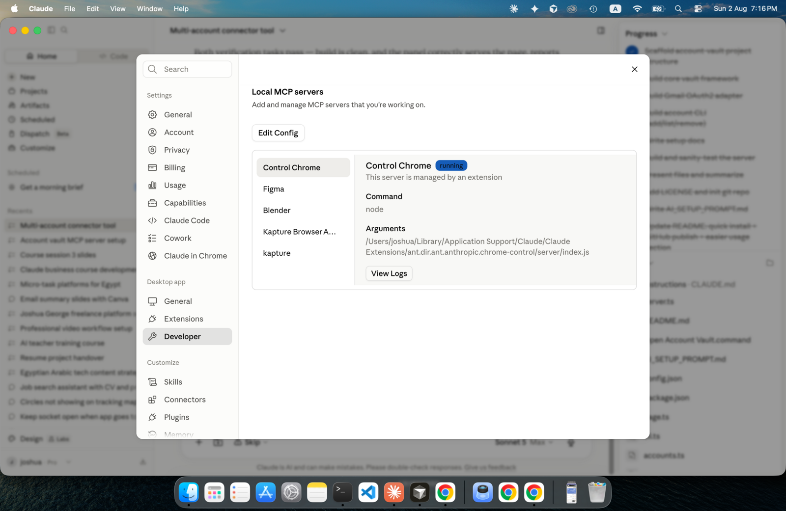
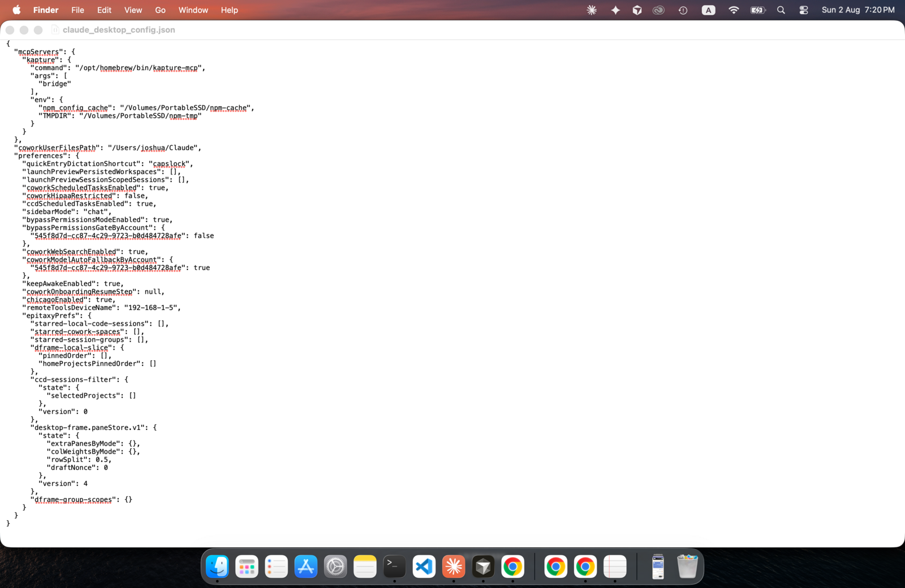
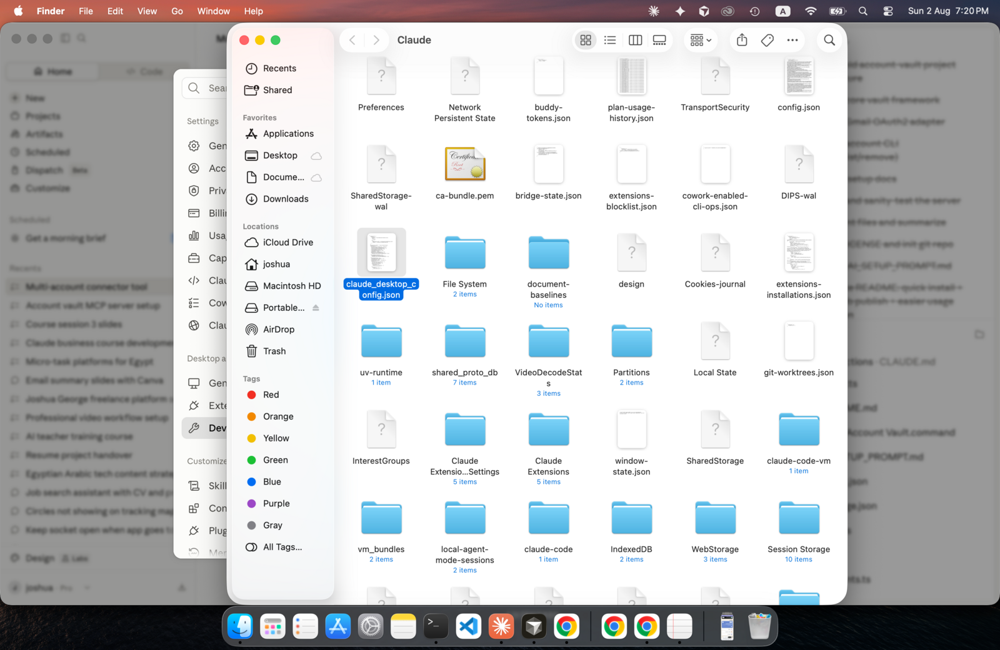
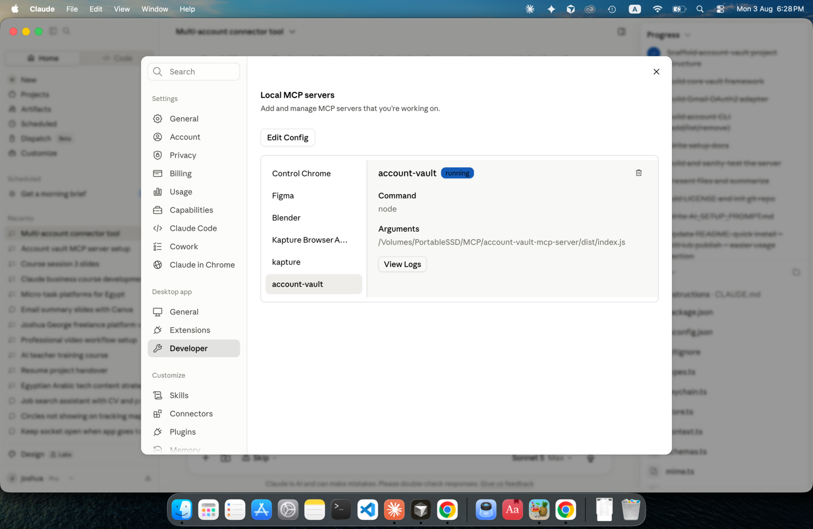

# Adding Account Vault to Claude Desktop — step by step, with screenshots

This walks through connecting `account-vault-mcp-server` to Claude Desktop using the
actual in-app screens, for anyone who'd rather see exactly what to click than follow
command-line instructions. No terminal use required for the steps below (you'll only
need one if a troubleshooting step at the end applies to you).

If you'd rather have an AI assistant do this whole thing for you instead, use
[`AI_SETUP_PROMPT.md`](../AI_SETUP_PROMPT.md) and skip this guide.

## Step 1 — Open Developer settings

In Claude Desktop: click the **Claude** menu (top-left of your screen) → **Settings**.
In the sidebar, under **Desktop app**, click **Developer**.



You'll see a list of any MCP servers already connected (yours may be empty, or may
already have others listed — that's fine either way).

## Step 2 — Open the config file

Click **Edit Config**. This opens `claude_desktop_config.json` — either directly in a
text editor, a quick preview, or by revealing it in Finder (exactly which happens depends
on your Mac's file associations).





If you land on a preview or Finder instead of an editable window, right-click the file →
**Open With** → **TextEdit** (TextEdit is pre-installed and simplest for this).

**If you don't see this file at all**, it hasn't been created yet — that's normal for a
fresh install. Create a new empty text file at that exact location and name instead, then
continue to Step 3.

## Step 3 — Add the account-vault entry

What you type here depends on what's already in the file.

**If the file is empty, or just contains `{}`:** select all the existing content and
replace it entirely with:

```json
{
  "mcpServers": {
    "account-vault": {
      "command": "node",
      "args": ["/Volumes/PortableSSD/MCP/account-vault-mcp-server/dist/index.js"]
    }
  }
}
```

(Change the path in `args` if you put this project somewhere other than
`/Volumes/PortableSSD/MCP`.)

**If the file already has an `mcpServers` block** (you'll see other server names in
there, each with their own `"command"` and `"args"`), you need to add `account-vault` as
a new sibling entry *inside* that same `mcpServers` block — not replace the file. For
example, if it currently looks like this:

```json
{
  "mcpServers": {
    "some-other-server": {
      "command": "...",
      "args": ["..."]
    }
  }
}
```

Change it to this (note the added comma after the existing server's closing `}`):

```json
{
  "mcpServers": {
    "some-other-server": {
      "command": "...",
      "args": ["..."]
    },
    "account-vault": {
      "command": "node",
      "args": ["/Volumes/PortableSSD/MCP/account-vault-mcp-server/dist/index.js"]
    }
  }
}
```

**A real warning from doing this exact edit ourselves:** TextEdit's automatic
capitalization silently turned `"command"` into `"Command"` and `"account-vault"` into
`"Account-vault"` while typing — both of which quietly break the file, since JSON keys
are case-sensitive, and Claude Desktop won't tell you why it's not working. Before you
type anything, turn this off: **Edit menu → Substitutions → Text Replacement** (click to
uncheck it). After you paste or type your edit, read it back once before saving and
double-check every key is lowercase exactly as shown above.

If nested JSON like this isn't something you're comfortable hand-editing precisely,
that's a completely reasonable place to stop and use
[`AI_SETUP_PROMPT.md`](../AI_SETUP_PROMPT.md) instead — hand it to an AI assistant and
let it make this specific edit for you.

Save the file (**Cmd+S**).

## Step 4 — Restart Claude Desktop

Fully quit Claude Desktop (**Cmd+Q** — closing the window isn't enough) and reopen it.

## Step 5 — Verify it connected

Go back to **Settings → Developer**. `account-vault` should now be listed, with a
**running** badge next to it:



(An equivalent check: start a new chat and click the tools/hammer icon near the message
box — `account-vault`'s tools like `vault_list_accounts` should be listed there too.)

**If it shows an error instead of "running":** click it to view the logs. The most
common cause is Claude Desktop not finding `node` — the config above uses the bare
command `node`, which needs to be on the system PATH that Claude Desktop launches with.
If logs mention `ENOENT` or "command not found":

1. Open Terminal and run `which node` to get its full path (e.g.
   `/usr/local/bin/node` or `/opt/homebrew/bin/node`).
2. In the config file, change `"command": "node"` to that full path instead, e.g.
   `"command": "/usr/local/bin/node"`.
3. Save, quit, and reopen Claude Desktop again.

## Step 6 — Add your first account

Nothing above adds an actual Gmail account — it only connects the server itself. For
that, double-click **`Open Account Vault.command`** in the project folder, which opens a
control panel in your browser for adding and managing accounts. See
[Local control panel](../README.md#local-control-panel) in the main README.
